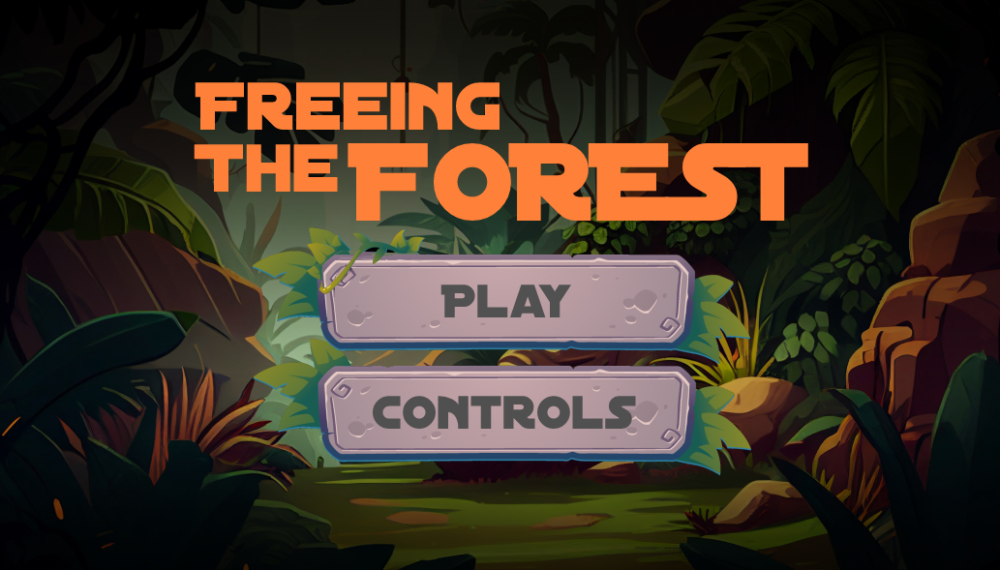
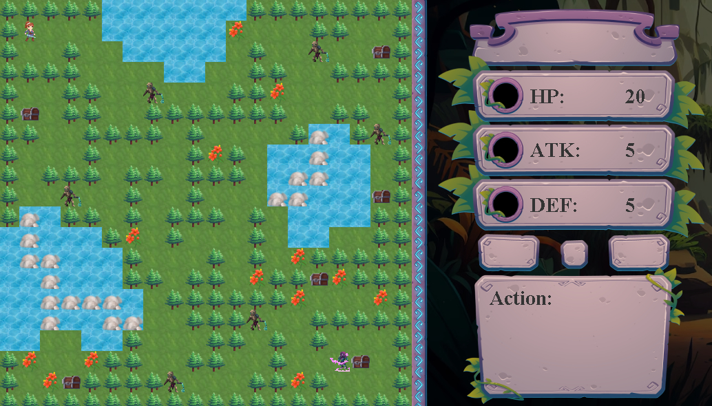
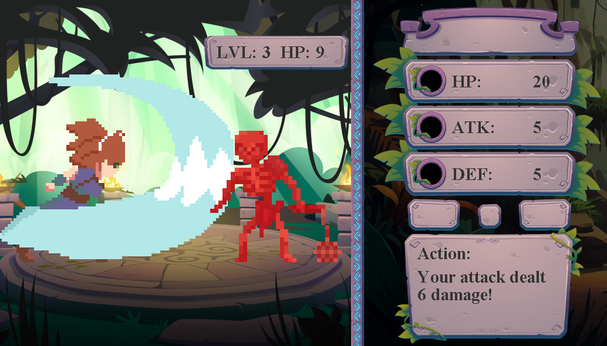
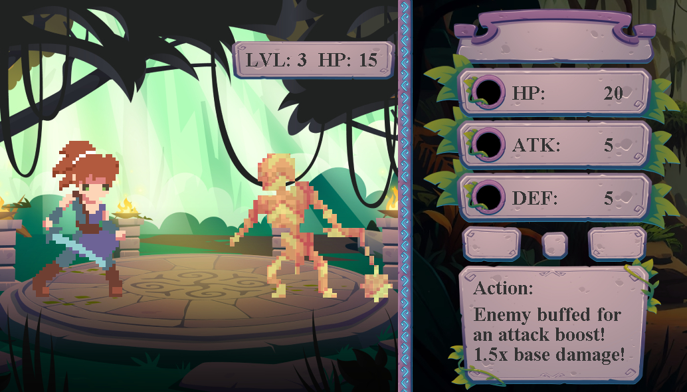
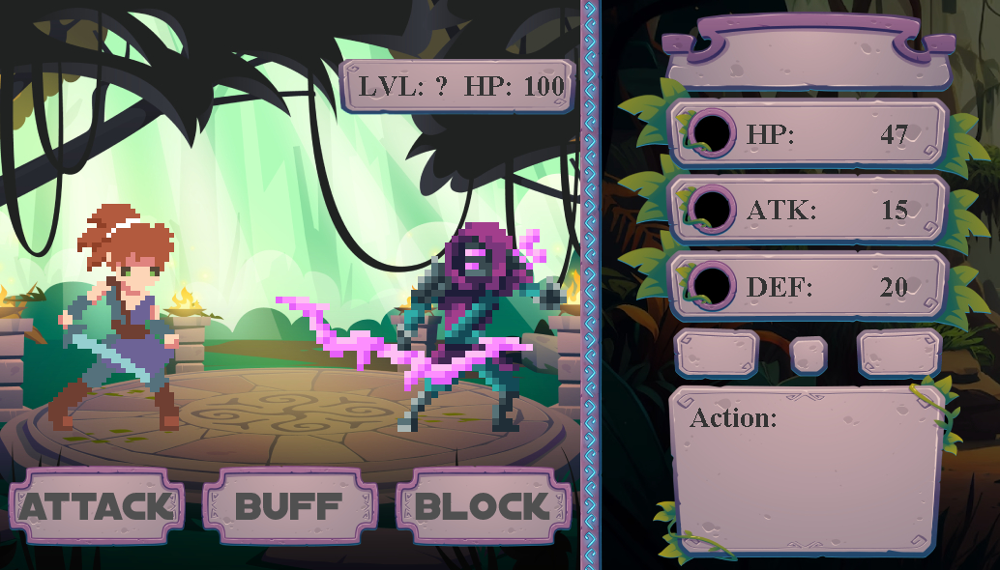
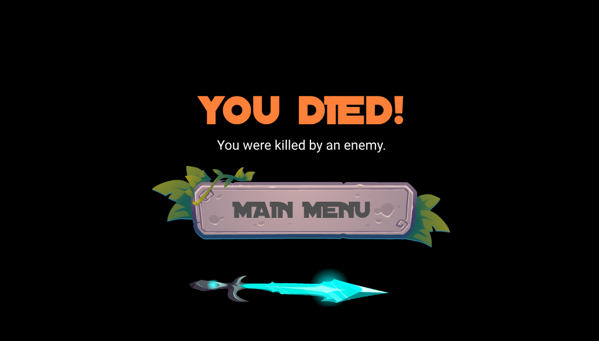
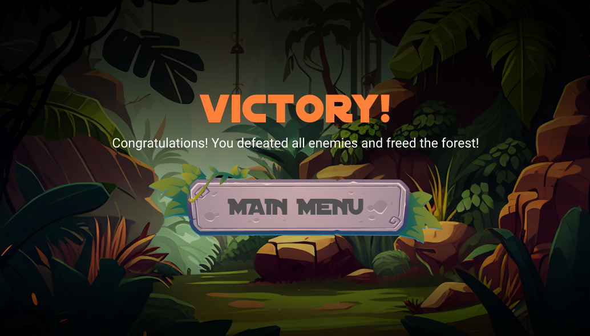

# Freeing The Forest - 2D RPG

## Description

This game takes the formula of rock-paper-scissors and expands it into an RPG-style game. Users navigate around the map, collecting powerups to aid them in enemy combat while avoiding environmental hazards. Users engage in combat with enemies, as battles become progressively more difficult with each encounter. Goal is to defeat all enemies to win.



## Features

-   Fully animated characters, overworld, powerups, battle scenes, and death sequences
-   Multiple enemy types and enemy levels
-   Modular components for strong encapsulation (private fields, classes communicate via function calls)
-   Initialization classes promoting code reusability (hoverButton, player, audioPlayer)
-   MVC (Model-View-Controller) design pattern
-   Custom music for various gamestates
-   Dynamic code allowing for the adjustment


Customizable maps - to edit the map, edit the file in 'map1.csv', using the guide below.<br>
Guide:

> Characters

-   'p' spawns the player (by default, player is spawned at 1, 1 if no coordinates are specified)
-   '0-9' spawns a corresponding enemy from level 0-9
-   'b' spawns a boss

> Interactables

-   's' spawns a sword powerup
-   'd' spawns a shield powerup
-   'f' spawns a flower powerup

> Static tiles

-   'g' creates a grass tile
-   't' creates a tree tile (players cannot walk over trees)
-   'w' creates a water tile (instantly kills player upon touching it)
-   'r' creates a rock tile (water tile which players are able to traverse)

Note: each tile must be defined. Failing to define a tile will create blank tiles.<br>
Note 2: there must be at least one enemy on the map, or else the player cannot win the game.

## Installation

To run the project:

1. Ensure [Java](https://www.oracle.com/ca-en/java/technologies/downloads/) is installed locally on your machine.
2. Clone the 'target' folder
3. Run the java executable located within it

To make code changes and recompile:

1. Ensure both [Maven](https://maven.apache.org/download.cgi) and [Java JDK](https://www.oracle.com/ca-en/java/technologies/downloads/) are installed on your machine
2. Clone the repository
3. Navigate to the /src/main directory and make changes to the respective files.
4. When finished, run 'mvn package' to compile the code and package it into a .jar file

```bash
mvn package
```

5. Navigate to the 'target' folder and run the java executable

NOTE: Within the target folder, there are folders containing various assets. The test folder project contains assertion files. Moving those folders will cause aforementioned packing process to fail.

## Project Structure

This project is split into the following directories:

/src -> contains source code<br>
&nbsp;&nbsp;&nbsp;&nbsp;/main - contains the java files<br>
&nbsp;&nbsp;&nbsp;&nbsp;/test - contains the test files Maven uses to determine build success or failure<br>
/pom.xml -> used by Maven to build the project<br>
/target -> directory where executable is built and where assets are stored

## Images









## Planned future features

-   Adding map selector screen when creating a new game
-   Custom player classes with different stat distributions (requires significant amount of spritework)

## Authors & Acknowledgements

Programming: James Treap.<br>
Image/asset/music contributions from the following royalty-free sources:

-   Skeleton and Archer characters by [AstroBob](https://astrobob.itch.io/) on Itch.io
-   Chest spritesheet by [Admurin](https://admurin.itch.io/free-chest-animations) on Itch.io
-   Music by [xDeviruchi](https://youtu.be/5bn3Jmvep1k)

Other assets made/edited by myself, or taken from [Freepik](https://www.freepik.com/).
